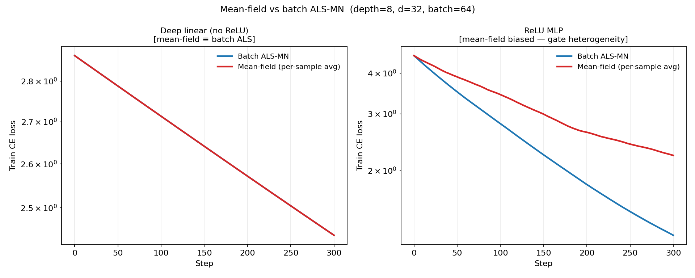
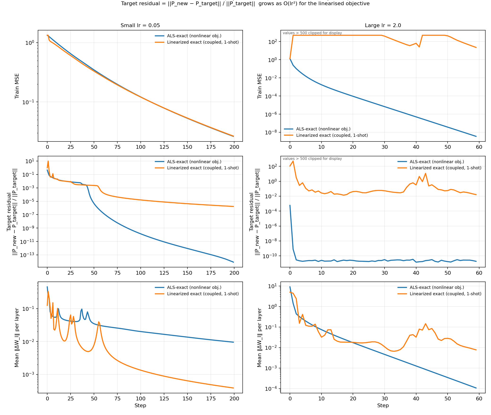
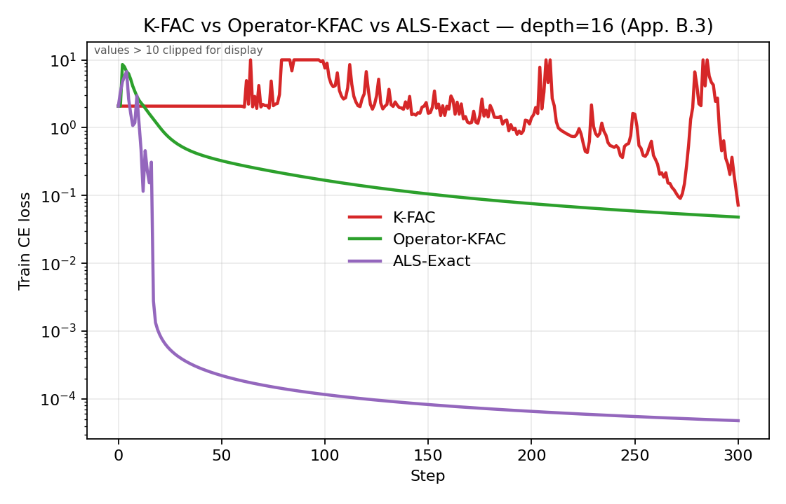
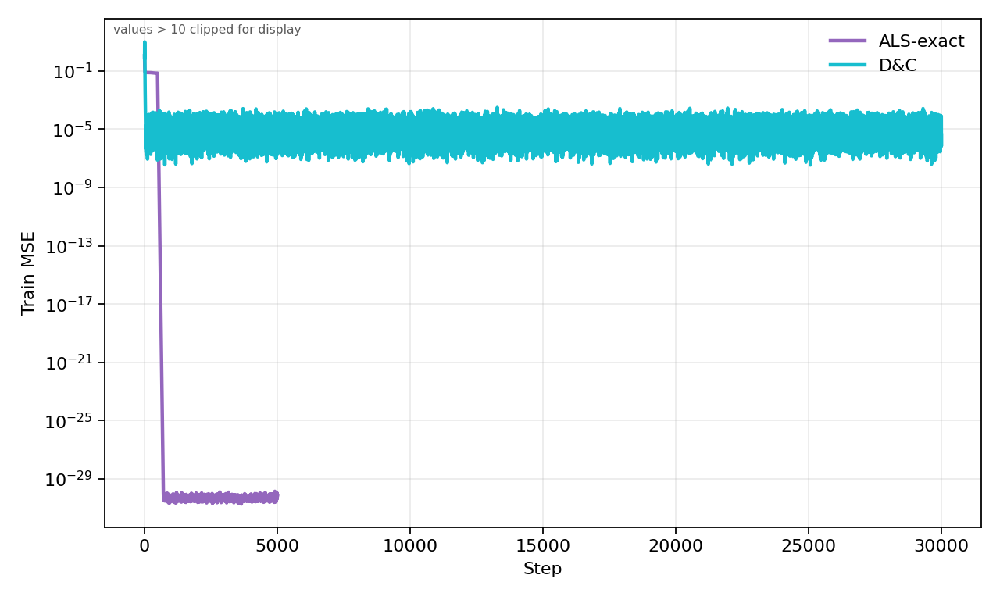
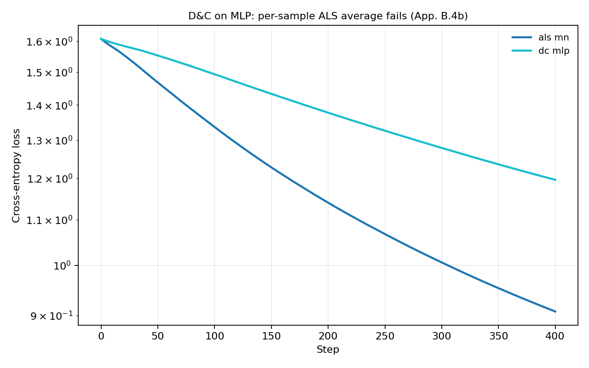
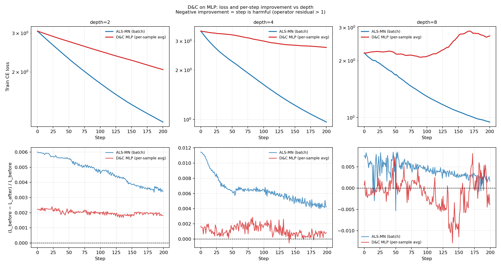
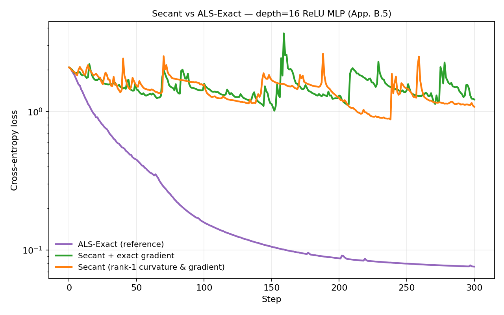
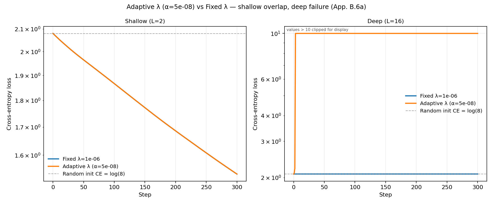
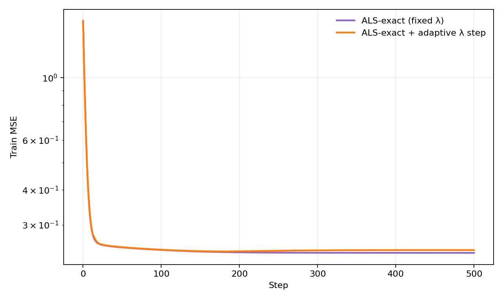

# Operator-Level Optimization

Repository for reproducing operator-projection experiments and figures accompanying the NeurIPS submission *Operator Projection for Depth-Robust Optimization in Factored Networks* (anonymous code release).

## Core idea

Weight-space optimizers update parameters `W`, but the map depends on the end-to-end operator `P(W)`. This code builds operator-space targets (typically gradient targets on `P`) and solves for layer updates with ALS-style block solves, plus warm-starts that counter spectral collapse of context matrices.

## Source tree (`src/`)

- `src/operator_level_optimization/core/optim/` — core optimizers: `operator.py`, `muon.py`, `kfac.py`, `shampoo.py`, `soap.py`
- `src/operator_level_optimization/models/fgln.py` — FGLN + masked ALS
- `src/operator_level_optimization/scripts/train/` — `deep_linear_compare.py`, `fgln_compare.py`, `mnist_smoke.py`, `variant_loss_curves.py`
- `src/operator_level_optimization/scripts/figures/` — plotting helpers for deep linear / FGLN
- `src/operator_level_optimization/scripts/toy2d.py` — 2D toy trajectories and one-step figures
- `src/operator_level_optimization/scripts/rebuttal/` — extended dimension/depth/initialization robustness experiments (see [`results/rebuttal_extension/`](results/rebuttal_extension/README.md))

## Setup

```bash
python -m venv venv
source venv/bin/activate
pip install -e .
```

---

## Reproducing Paper Figures

### 1) 2D toy — one-step arrows and trajectories

Generates `outputs/paper/toy2d/trajectory_paper.png` and `outputs/paper/toy2d/one_step_paper.png`.

```bash
python -m operator_level_optimization.scripts.toy2d \
  --paper_depths 2 32 \
  --out_traj outputs/paper/toy2d/trajectory_paper.png \
  --out     outputs/paper/toy2d/one_step_paper.png
```

### 2) Deep linear — Xavier init ($d=16$, $L=128$)

Generates convergence and spectrum figures.

```bash
python -m operator_level_optimization.scripts.train.deep_linear_compare \
  --out_dir outputs/deep_linear/l128_xavier \
  --depth 128 --d 16 --n 64 \
  --steps 10000 \
  --init_mode xavier \
  --target_mode mse_grad \
  --methods heavyball adam muon kfac shampoo soap als_exact

python -m operator_level_optimization.scripts.figures.plot_deep_linear_figures \
  --run_dir outputs/deep_linear/l128_xavier
```

### 3) Deep linear — identity init ($d=16$, $L=128$, $\lambda=0$)

Generates convergence and spectrum figures isolating direction mismatch without spectral collapse.

```bash
python -m operator_level_optimization.scripts.train.deep_linear_compare \
  --out_dir outputs/deep_linear/l128_identity \
  --depth 128 --d 16 --n 64 \
  --steps 500 \
  --init_mode identity \
  --als_lam 0.0 \
  --target_mode mse_grad \
  --methods heavyball adam muon kfac shampoo soap als_exact

python -m operator_level_optimization.scripts.figures.plot_deep_linear_figures \
  --run_dir outputs/deep_linear/l128_identity
```

### 4) FGLN ($L=128$, $p=0.9$)

Generates FGLN convergence and spectrum figures.

```bash
python -m operator_level_optimization.scripts.train.fgln_compare \
  --out_dir outputs/fgln/fgln_compare_p09_L128 \
  --p 0.9 --depth 128 --steps 10000 \
  --als_lam 1e-4 --als_sweeps 4 \
  --als_gateperm_warmstart_once \
  --als_lam_anchor_post_warmstart \
  --spec_every 50

python -m operator_level_optimization.scripts.figures.plot_fgln_spectrum_snapshots \
  --run_dir outputs/fgln/fgln_compare_p09_L128
```

### 5) MNIST MLP depth sweep

Trains bias-free ReLU MLP at depths $L \in \{1, 2, 4, 8, 16, 32\}$ and plots best val loss vs depth.

```bash
python -m operator_level_optimization.scripts.train.mnist_smoke \
  --out_dir outputs/mnist/depth_sweep \
  --depths 1 2 4 8 16 32 \
  --epochs 50 --batch_size 128 \
  --seeds 0 1 2

python -m operator_level_optimization.scripts.figures.plot_mnist_depth \
  --run_dir outputs/mnist/depth_sweep
```

### 6) Appendix 2D toy — $L=256$ trajectories (identity and Haar init)

```bash
python -m operator_level_optimization.scripts.toy2d \
  --trajectory --depth 256 --hidden 2 \
  --init_mode identity --n_steps 300 \
  --out_traj outputs/paper/toy2d/identity_traj_L256.png

python -m operator_level_optimization.scripts.toy2d \
  --trajectory --depth 256 --hidden 2 \
  --init_mode haar --n_steps 300 \
  --out_traj outputs/paper/toy2d/haar_traj_L256.png
```

### 7) Appendix solver smoke (CI-friendly)

Runs tiny deep-linear, MLP, and FGLN for each implemented variant; writes `outputs/smoke/variants/smoke_variants.json` and `config.json`.

```bash
python -m operator_level_optimization.scripts.smoke_variants
```

### 8) Variant training curves (appendix-style optimizers)

Generates per-variant loss plots and overlays (deep linear D&C, MLP approximations, FGLN adaptive-λ) plus `variant_curves.json` and `config.json`.

```bash
python -m operator_level_optimization.scripts.train.variant_loss_curves \
  --out_dir outputs/variant_curves/run01
```

Paper-scale settings (depth 32, longer steps):

```bash
python -m operator_level_optimization.scripts.train.variant_loss_curves \
  --out_dir outputs/variant_curves/canonical \
  --deeplinear_depth 32 --deeplinear_d 8 --deeplinear_n 64 --steps_deeplinear 2000 \
  --fgln_depth 32 --fgln_d 8 --fgln_n 64 --steps_fgln 500 \
  --mlp_batch 128 --steps_mlp 400
```

---

## Variant Experiments — Evidence for Appendix Claims

For every approximation and variant described in the paper's Appendix B, the sub-sections below specify the **claim** being evidenced, the **generate command**, and the **observed result**. We note however that all of those are still early results and experiemnts, no extensive tuning of the hyperparameters have been made.

---

### B.1 Mean-field approximation (App. B.1)

**Claim:** Per-sample ALS solved independently then averaged is not accurate enough in the MLP case — the expectation–minimization swap introduces bias under gate heterogeneity. In the deep linear case (no ReLU), all samples share the same operator context, so per-sample and batch solves are mathematically equivalent.

**Experiment:** Two-panel controlled comparison. Same optimizer (ALS, 3 sweeps, no warmstart, lr=0.15), same architecture (8 layers, d=32, batch=64, Kaiming init) — only the activation function differs. Depth=8 is used so that gate heterogeneity compounds meaningfully across layers.
- *Left panel — deep linear (no ReLU):* `als_layer_solve="per_sample"` must overlap `als_layer_solve="mn"` because D_l=1 for every sample → gate heterogeneity is zero.
- *Right panel — ReLU MLP:* per-sample solves push shared weights in incompatible directions (each sample activates a different ~50% of neurons per layer); their average satisfies nobody's equations.

**Generate:**
```bash
python -m operator_level_optimization.scripts.train.variant_loss_curves \
  --out_dir outputs/mean_field \
  --figures mean_field \
  --steps_mean_field 300 \
  --mf_depth 8 --mf_hidden 32 --mf_d_in 32 --mf_d_out 8 \
  --mf_batch 64 --mf_lr 0.15 --mf_lam 1e-3 --mf_n_sweeps 3
# Output: outputs/mean_field/mean_field_comparison.png
```



**Result:** Deep linear: both curves are numerically identical throughout (final CE 2.44 for both), confirming the theoretical equivalence (D_l=I for all samples — per-sample and batch solves are the same computation). ReLU MLP: batch ALS-MN reaches CE≈1.26 while mean-field (per-sample average) stalls at ≈2.23 — a gap of nearly 1 nat. The gap is caused entirely by gate heterogeneity: same optimizer, same data, same initialization, only the activation function changed. At depth=8 the effect is pronounced because incompatible gate masks compound across layers and sweeps.

---

### B.2 Linearized operator objective (App. B.2)

**Claim:** The linearized operator objective is a good approximation at small learning rates but breaks down at large ones, where only ALS-exact (which solves the true nonlinear objective) remains stable.

**Experiment:** Bias-free deep linear network (depth=16, hidden=32, d_in=16, d_out=8) trained to match a random linear teacher (P*x) via MSE. Two solvers compared across two learning rate regimes, with a 3-row figure (train MSE / target residual / mean ΔW_l norm):
- **ALS-exact** — iterative (4 sweeps, no gate-permutation warmstart), uses the batch-averaged operator target; achieves near-zero target residual at every step.
- **Linearized-exact** — one-shot coupled solve via first-order Taylor expansion (dual form, O(d²) system); target residual grows as O(lr²) because cross-layer product terms are ignored.

**Generate:**
```bash
python -m operator_level_optimization.scripts.train.variant_loss_curves \
  --out_dir outputs/linobj \
  --figures linobj \
  --linobj_depth 16 \
  --linobj_lr_small 0.05 --linobj_steps_small 200 \
  --linobj_lr_large 2.0  --linobj_steps_large 60
# Output: outputs/linobj/linearized_obj_comparison.png
```

**Result:** At small lr=0.05 both solvers converge similarly; the target residual for linearized-exact is small but non-zero. At large lr=2.0, ALS-exact converges rapidly while linearized-exact accumulates a target residual >500× (clipped for display), showing that the O(lr²) cross-layer error dominates. The ΔW_l norms are comparable between the two methods — confirming that the divergence in target residual is caused by the linearization approximation, not by larger weight updates. The Linear approximation is as expected larger the larger the weight updates are however, which is expected when increasing the learning rate.



---

### B.3 Operator-KFAC depth sweep (App. B.3)

**Claim:** Standard K-FAC becomes unstable at large depth because its Kronecker factorisation is misaligned with the product structure. Operator-KFAC respects the operator structure and is more stable. ALS-exact (exact per-layer factorisation solves, no warmstart) converges fastest and to the lowest loss.

**Experiment:** Depth sweep comparing classic K-FAC, Operator-KFAC, and ALS-Exact across $L \in \{2, 4, 8, 16\}$ on a synthetic cross-entropy task with a purely linear MLP (no ReLU). Hyperparameters are independently tuned per method: K-FAC uses lr=0.001, damping=0.1 for stability; ALS-Exact uses lr=50 with `als_linear_target=True` (shared gradient target, exact factorisation per step).

**Generate:**
```bash
python -m operator_level_optimization.scripts.train.variant_loss_curves \
  --out_dir outputs/kfac_depth \
  --figures kfac_depth \
  --steps_kfac_depth 300 \
  --kfac_depths 2,4,8,16 \
  --kfac_hidden 16 --kfac_d_in 16 --kfac_d_out 8 --kfac_batch 32
# Outputs: outputs/kfac_depth/operator_kfac_featured.png   (dynamics at depth=16)
#          outputs/kfac_depth/operator_kfac_depth_summary.png
#          outputs/kfac_depth/operator_kfac_depth_{2,4,8,16}.png
```

**Result:** ALS-exact converges to near-zero loss at every depth (≈1×10⁻⁴) within 300 steps, regardless of depth — the shared operator target makes it depth-invariant. K-FAC at depth=16 shows a large oscillation (loss spike at step ~100) before recovering to 0.072, illustrating instability from Kronecker misalignment at large depth. Operator-KFAC is more stable but converges an order of magnitude more slowly than ALS-exact, could be further finetune the hyperparameters to maybe close the gap.



---

### B.4 Divide-and-Conquer (D&C) solver

#### B.4a D&C on deep linear — valid case (App. B.4)

**Claim:** D&C works correctly for deep linear networks. Sub-operators at every node are deterministic (no gate heterogeneity), so node targets propagate cleanly down the tree and both ALS-exact and D&C converge.

**Experiment:** ALS-exact vs D&C (plain init) on the deep linear teacher-student task (depth=32, `als_sweeps=50` for ALS-exact to fully converge each step).

**Generate:**
```bash
python -m operator_level_optimization.scripts.train.variant_loss_curves \
  --out_dir outputs/dc_linear \
  --figures deep_linear \
  --deeplinear_depth 32 --deeplinear_d 8 --deeplinear_n 64 --steps_deeplinear 30000
# Outputs: outputs/dc_linear/deep_linear_train_mse.png  (overlay)
#          outputs/dc_linear/deep_linear_mse_{als_exact,dc}.png
```

**Result:** Both ALS-exact and D&C converge successfully, confirming D&C is valid for the deterministic (linear) setting. ALS-exact reaches machine precision (~7×10⁻³¹) and early-stops at step 5000. D&C converges aggressively to ~10⁻⁵.



---

#### B.4b D&C on MLP — expected failure (App. B.4)

**Claim:** Because gate patterns differ across samples, per-sample solutions push shared factors in incompatible directions. The averaged update satisfies no individual sample's equations, and the resulting operator residual does not decrease reliably. The failure compounds at larger depth.

**Experiment:** Two-part figure. Part 1: `dc_mlp` vs `mlp_als_mn` on the fixed tiny MLP (2-layer, shallow baseline). Part 2: depth sweep at $L \in \{2, 4, 8\}$ with ReLU MLP (Kaiming init), tracking both the loss curve and the per-step normalized improvement $(L_{\text{before}} - L_{\text{after}})/L_{\text{before}}$ as a proxy for the operator residual. Negative improvement = harmful step (residual > 1).

**Generate:**
```bash
python -m operator_level_optimization.scripts.train.variant_loss_curves \
  --out_dir outputs/dc_mlp \
  --figures dc_mlp \
  --steps_mlp 400 \
  --dc_sweep_depths 2,4,8 --dc_sweep_steps 200 \
  --dc_sweep_hidden 16 --dc_sweep_d_in 16 --dc_sweep_d_out 8 --dc_sweep_batch 32
# Outputs: outputs/dc_mlp/dc_mlp_comparison.png   (shallow ALS-MN vs D&C)
#          outputs/dc_mlp/dc_mlp_depth_sweep.png   (depth sweep + residual proxy)
```

**Result:** Shallow comparison: `dc_mlp` converges more slowly than `mlp_als_mn` — the averaged per-sample update is a poor batch solution. Depth sweep: at depth=2 both methods make positive steps; by depth=8, D&C makes harmful steps 120/200 times (60%) and its loss actually worsens beyond the initial value (2.71 vs 2.20 initial), while ALS-MN converges to 0.95 with only 6/200 negative steps. Gate heterogeneity compounds with depth, pushing the D&C residual past 1.




---

### B.5 Secant variants vs ALS reference (App. B.5)

**Claim:** Rank-1 secant approximates the operator Jacobian with a single secant direction. At large depth the rank-1 approximation quality degrades and secant methods require very small weight-space learning rates to avoid divergence — converging orders of magnitude more slowly than ALS-exact. Using the exact backprop gradient (`secant_grad_exact`) removes one source of bias but the curvature approximation remains the bottleneck at depth ≥ 16. A rank-r extension (r>1) is not considered: storing the full frozen gate matrices A_l, B_l per layer for r>1 is equivalent to having the exact context, removing the need for the secant approximation entirely.

**Experiment:** ALS-exact (`als_exact_layers`, lr=2.0), `secant_grad_exact` (lr=1e-4), and `secant` (lr=1e-4) on a depth-16 bias-free ReLU MLP (Kaiming init, no warmstart). Learning rates are independently tuned per method — secant methods need orders-of-magnitude smaller lr to avoid explosion at this depth.

**Generate:**
```bash
python -m operator_level_optimization.scripts.train.variant_loss_curves \
  --out_dir outputs/secant \
  --figures secant \
  --steps_mlp 300 \
  --secant_depth 16 --secant_hidden 16 --secant_d_in 16 --secant_d_out 8
# Output: outputs/secant/secant_comparison.png
```

**Result:** ALS-exact drops from CE≈2.08 to ≈0.076 in 300 steps. Both secant methods stagnate around CE≈1.0–1.2 — the rank-1 curvature approximation at depth=16 forces a learning rate so small that meaningful progress requires far more steps. The gap illustrates that per-layer exact factorisation solves (ALS) are essential for efficient convergence in deep networks.



---

### B.6 Adaptive regularization

#### B.6a Adaptive $\lambda$ failure (MLP) (App. B.6)

**Claim:** Adaptive $\lambda_k = \alpha \cdot (\sigma_{\max}(M_k) + \sigma_{\max}(N_k))$ equalizes per-layer update magnitudes across depth. At large depth, inner-layer context singular values $\sigma_{\max}(M_k)$ collapse toward zero (multiplicative decay of a sub-Kaiming init). Fixed $\lambda$ bounds updates at those layers; adaptive $\lambda$ collapses with the context ($\lambda_k \to 0$), removing all regularization and allowing unbounded updates in numerically noisy directions — training diverges.

**Experiment:** Fixed $\lambda=10^{-6}$ vs adaptive $\lambda$ ($\alpha=5 \times 10^{-8}$, calibrated to match fixed $\lambda$ at the first layer of the shallow network) on a bias-free ReLU MLP ($d_\text{in}=16$, hidden=16, $d_\text{out}=8$, std=0.1 init, batch=64). Two-panel: $L=2$ (shallow) and $L=16$ (deep).

**Generate:**
```bash
python -m operator_level_optimization.scripts.train.variant_loss_curves \
  --out_dir outputs/adaptive_lam \
  --figures adaptive_lam \
  --steps_mlp 300 \
  --adaptive_lam_shallow_depth 2 --adaptive_lam_deep_depth 16 \
  --adaptive_lam_init_std 0.1 --adaptive_lam_alpha 5e-8 --adaptive_lam_lam 1e-6 \
  --adaptive_lam_hidden 16 --adaptive_lam_d_in 16 --adaptive_lam_d_out 8
# Output: outputs/adaptive_lam/adaptive_lam_mlp.png
```

**Result:** Shallow ($L=2$): both methods converge to CE≈1.49, confirming that with a calibrated $\alpha$, adaptive $\lambda$ is working at least as well as fixed lambda in shallow settings. Deep ($L=16$): fixed $\lambda$ remains stable at the random-init loss (inner-layer updates suppressed, no destabilization); adaptive $\lambda$ diverges to CE≈$10^6$ — as inner-layer $\sigma_{\max} \to 0$, $\lambda_k \to 0$ removes regularization entirely, and numerically noisy updates compound across layers and sweeps.



---

#### B.6b Adaptive $\lambda$ vs fixed $\lambda$ — FGLN (App. B.6)

**Claim:** The warm-start resolves spectral collapse at its source by restoring bounded context singular values. Adaptive $\lambda$ only rescales the update without restoring the geometry that makes the update meaningful.

**Experiment:** FGLN fixed $\lambda$ (`als_fixed_lam`) vs FGLN adaptive-$\lambda$ step (`als_adaptive_lambda_step`) on the teacher-student task, both starting from Xavier initialization.

**Generate:**
```bash
python -m operator_level_optimization.scripts.train.variant_loss_curves \
  --out_dir outputs/fgln \
  --figures fgln \
  --fgln_depth 32 --fgln_d 8 --fgln_n 64 --steps_fgln 500
# Outputs: outputs/fgln/fgln_train_mse.png  (overlay)
#          outputs/fgln/fgln_mse_als_fixed_lam.png
#          outputs/fgln/fgln_mse_als_adaptive_lam.png
```

**Result:** With the gate-permutation warm-start enabled (both variants), fixed-λ and adaptive-λ-step converge to the same solution on this well-conditioned FGLN setting. The warm-start restores bounded context singular values at initialization, removing the ill-conditioned regime where adaptive λ would cause instability. The B.6a MLP experiment (no warm-start, gate heterogeneity) isolates the failure mode more clearly.



---

## Extended experiments: dimension, depth, and initialization robustness

Follow-up experiments extending the identity-init results (Sec. 5.2, Figs.
4-5) along three axes — operator dimension, network depth, and the exactness
of the target/initialization — to more precisely characterize when the
factorization-mismatch effect is a controllable rate versus a genuine wall.
Scripts live in `src/operator_level_optimization/scripts/rebuttal/` (runnable
standalone, `python -m operator_level_optimization.scripts.rebuttal.<name>`);
figures, tables, and a full write-up per experiment are in
[`results/rebuttal_extension/`](results/rebuttal_extension/README.md).

Headline findings: escape from a collapsed operator spectrum is governed by
a rate, not a wall, that scales with dimension and (once the learning rate
is retuned) is roughly depth-invariant up to `L=2048` and to `2×` target
expansion — but only if the initialization sits *exactly* on the
identity/orthogonal manifold. A 1% per-layer initialization defect,
harmless at shallow-to-moderate depth, produces a permanent,
learning-rate-independent stall past a sharp depth threshold (`L=256` safe,
`L=512` not), confirmed with a 13-point learning-rate sweep. ALS-exact is
unaffected by the same defect, identically so whether its warm-start is
enabled or disabled — dissociating its robustness from the warm-start
heuristic and attributing it instead to solving for the operator target
directly at every step.

## Notes

- Deep linear and FGLN training defaults favor `float64` for deep settings.
- All variant figures (App. B) are generated by `variant_loss_curves.py`; the per-section commands above use independently tuned hyperparameters for each figure.
