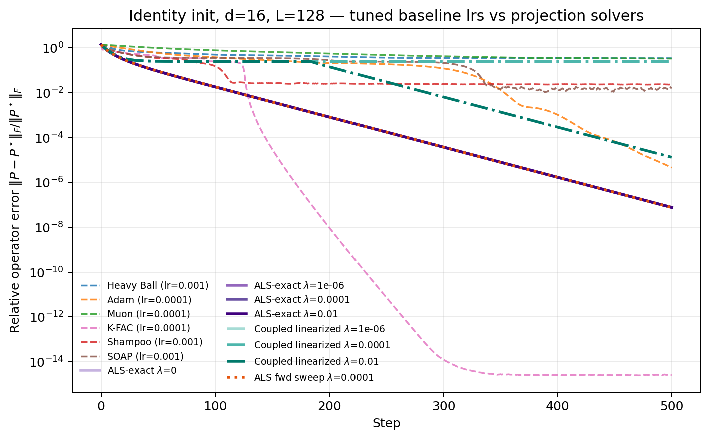
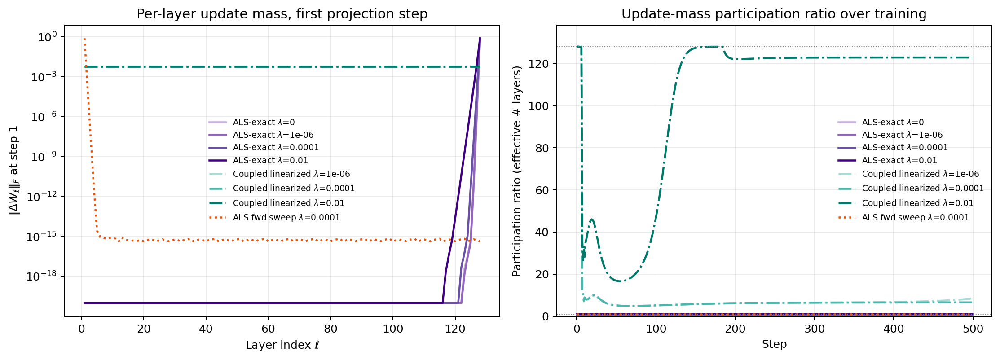
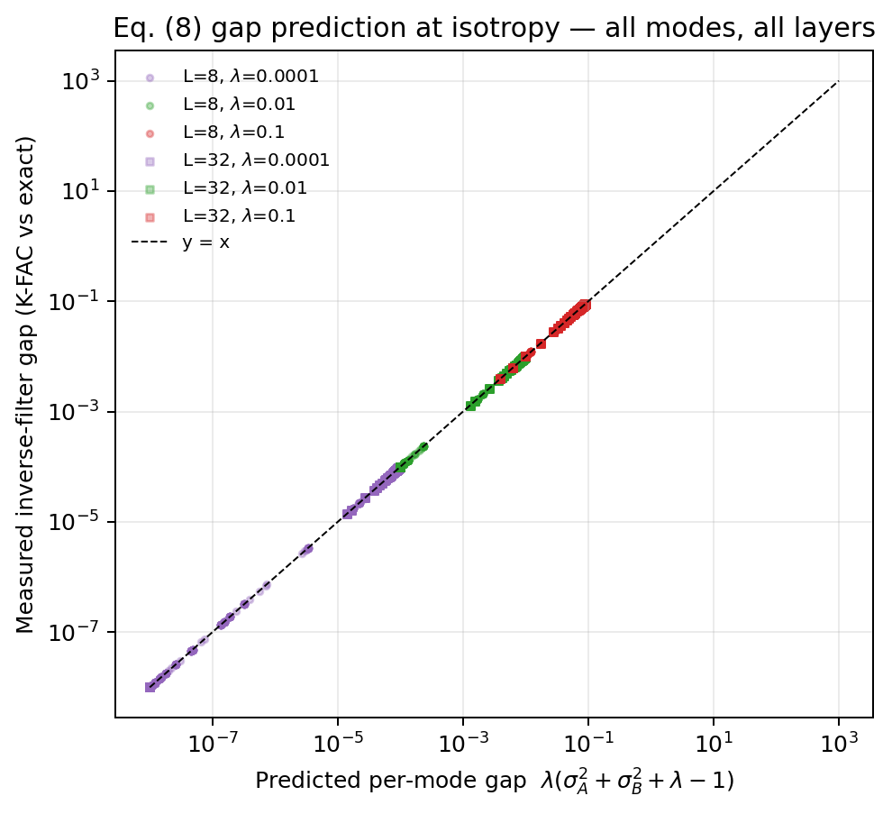
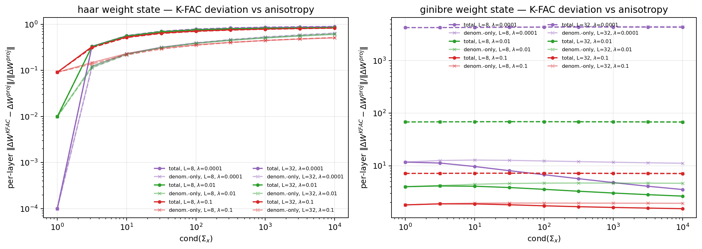
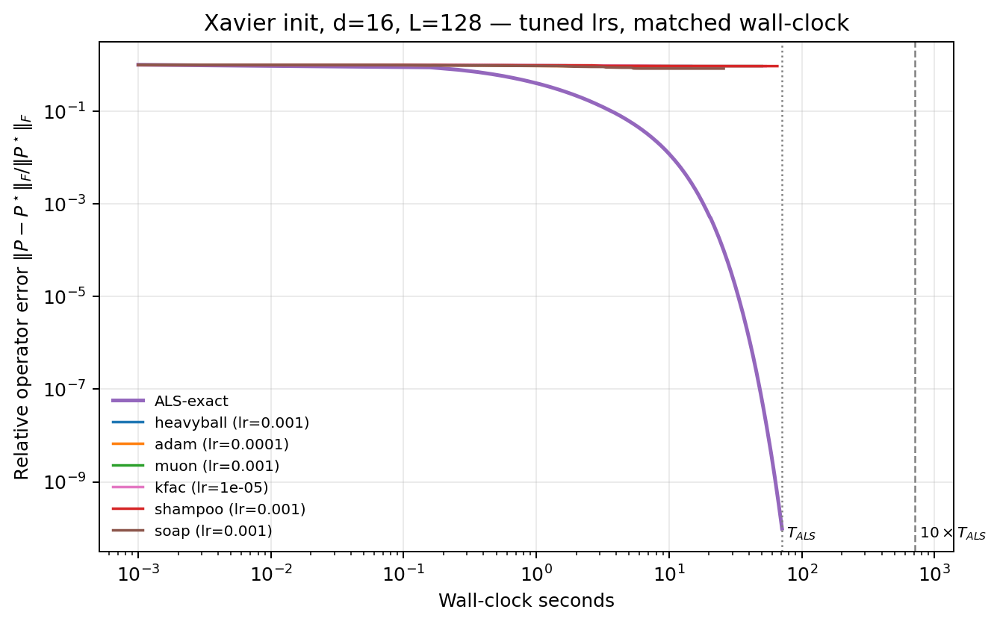
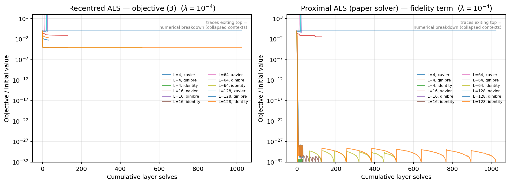
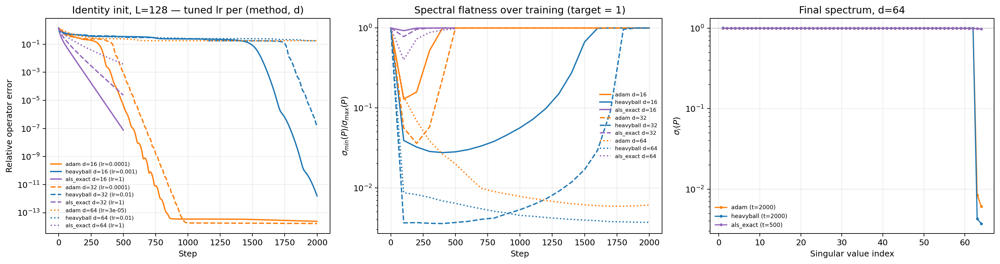
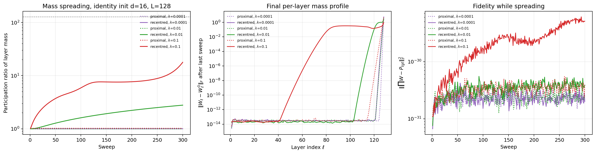
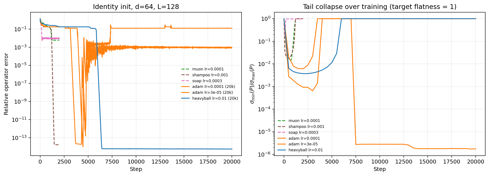
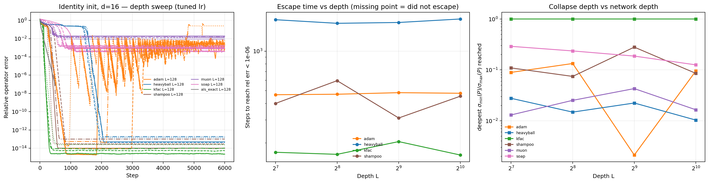

# Depth-robustness extension experiments

This directory collects a set of follow-up experiments run after the initial
submission, extending the deep-linear identity-init results in the paper
(Sec. 5.2, Figs. 4-5) along three axes: operator dimension, network depth, and
the exactness of the target/initialization. All scripts live in
`src/operator_level_optimization/scripts/rebuttal/` and are runnable
standalone:

```bash
PYTHONPATH=src python -m operator_level_optimization.scripts.rebuttal.<script_name> \
    --out_dir results/rebuttal_extension/<name>
```

Everything below is float64, CPU, deep-linear identity init (`init_mode
identity`) unless stated otherwise. `d` is the operator dimension, `L` the
depth (number of layers).

## 1. Identity-init λ-sweep and per-layer update mass (`x1_identity_lambda_sweep.py`)

At `d=16`, `L=128`, tuned baseline learning rates, the projected (ALS) update
reaches `7.7e-8` relative operator error, insensitive to `λ ∈ {0, 1e-6, 1e-4,
1e-2}` to ten significant digits. The sequential ALS solver concentrates the
update mass at the first-visited layer (participation ratio ≈ 1, flips to the
opposite end if the sweep order is reversed) — this is a property of the
*solver* (it penalizes each visit's increment rather than the increment
accumulated since the step began), not of the underlying objective. See
`x6_mass_spread.py` below for the fix.




## 2. K-FAC vs the exact modewise solve under anisotropy (`x2_kfac_anisotropy.py`)

Tests the paper's Eq. 8 prediction that K-FAC coincides with the exact
modewise projection exactly at isotropy (`Σ_x = I`), with a specific gap
`λ(σ_A² + σ_B² + λ − 1)` as isotropy breaks. At isotropy, the measured gap
matches the prediction to a relative deviation below `1e-7` across all modes
and layers (float64). As `cond(Σ_x)` grows to `1e4`, K-FAC's deviation from
the exact solve grows to `0.83-0.90` (Haar-orthogonal weight states),
decomposed into a separable-denominator component (what Eq. 8 accounts for)
and a basis-rotation component.




## 3. Wall-clock, memory, and matched-budget fairness (`x3_fairness.py`)

Per-step cost at `d=16`, `L=128`: ALS-exact costs `104ms` vs `2.9ms` for Adam
on CPU (`36×`), `683` vs `4.0ms` on GPU; ALS-exact has the lowest memory
footprint of any method (no optimizer state). Under a matched wall-clock
budget (Xavier init, tuned learning rates), ALS+warm-start reaches `9.8e-11`
in 700 steps / 71s, while every baseline including tuned K-FAC stalls at
`0.83-0.94` (near initialization level) even given ALS's full time budget
(up to ~25,000 steps for the cheaper baselines).

 · [cost table](e3_fairness/table_e3_cost.md)

## 4. ALS monotonicity and failure modes (`x4_monotone.py`)

Verifies the block-coordinate-descent monotone-decrease argument numerically
across 72 float64 instances (identity, Xavier, Ginibre weight states):
monotone to roundoff in every well-conditioned instance. The only exceptions
are numerical breakdown of the solve itself in collapsed regimes, either
`σ_max⁴/λ` exceeding the float64 range or the context Gram matrices
underflowing to exactly zero — both now flagged by the collapse monitor
added to `core/optim/operator.py` and `deep_linear_compare.py`
(`als_collapse_metric`, tracking `min-eig(M)·min-eig(N)` vs `λ`).



## 5. Does tuned Adam's identity-init escape survive width and spectral scrutiny? (`x5_adam_spectra_dims.py`)

Every parameter-space optimizer transiently collapses the operator's tail
singular values even from a perfectly isotropic identity-init start. Escape
time grows sharply with operator dimension `d`: at `d=64`, Adam and heavy-ball
remain stuck (~0.18) after 2000 steps, needing far more steps or a smaller
learning rate to escape, while ALS never collapses at any `d` tested, and
K-FAC's brief dip recovers fast (proximity to the projection structure
predicts recovery speed).



## 6. Sequential (proximal) vs anchored (true block-descent) mass spreading (`x6_mass_spread.py`)

The concentrated-update-mass finding in (1) is specific to a solver detail:
the released ALS step penalizes each visit's increment relative to the
*current* weights (a proximal variant), not the increment accumulated since
the step began. Anchoring the penalty at the step-initial weights — the
literal reading of the paper's objective — spreads the update mass across
layers at a rate set by `λ` (participation ratio 1 → 17.8 over 300 sweeps at
`λ=0.1`), at unchanged fidelity.



## 7. Escape dynamics at `d=64` over a long budget (`x7_d64_escape.py`)

No hard wall at `d=64`, `L=128`: heavy-ball converges to `5.6e-15` by ~10,000
steps; Shampoo reaches `1.6e-14` within 2,000; Adam escapes at a smaller
learning rate (`8.6e-4` at 20,000 steps, still descending) but is
*permanently* stuck at its 2,000-step-optimal learning rate (tail flatness
collapses to `2e-6`, zero progress from step 10,000 to 20,000). The fast
recoverers (K-FAC, Shampoo) share two-sided Kronecker-type preconditioning —
consistent with K-FAC's identification (Sec. 3.3) as the separable
approximation of the modewise projection.



## 8. Full learning-rate grid, all six baselines (`x8_lr_grid_full.py`)

Eleven learning rates spanning `{1e-1, ..., 1e-6}`, `d=16`, `L=128`, 2000
steps each. Every method's optimum lies strictly inside the grid (no baseline
is under-tuned at a boundary).

[full grid table](e8_lr_grid_full/table_e8_lr_grid.md)

## 9. One-step Table-1 cosine, learning-rate invariance (`x9_table1_lr_invariance.py`)

Re-measures the paper's Table 1 one-step alignment cosine across a
`{1e-1, ..., 1e-6}` learning-rate grid. Flat to within `1e-3` over all five
decades for heavy-ball, Adam, Muon, Shampoo, SOAP (Adam: flat to `1e-12`).
K-FAC is equally flat below `1e-3` and deviates only where its preconditioned
step is large enough that the one-step linearization itself breaks down —
three orders of magnitude above the rate used in the paper's Table 1.

[cosine-vs-lr table](e9_table1_lr/table_e9_cosine_vs_lr.md)

## 10-12. Collapse monitor, depth-aware schedules, extended `d=64` coverage

`x10_monitor_demo.py` demonstrates the collapse monitor firing 128/128 layer
solves under Xavier init without warm-start (context Gram products
underflowing to exactly zero) vs 0/128 under identity init or with the warm
start. `x12_lr_schedules.py` tests warmup and depth-scaled (`η/√L`, `η/L`)
learning-rate schedules for Adam and heavy-ball: none escapes the Xavier
collapse at `L=128` (all stall at `0.93-0.97`), and none changes the
identity-init picture. `x7_d64_escape.py` additionally covers Muon, Shampoo,
SOAP at `d=64` and long-budget (20k-step) Adam/heavy-ball runs.

## 13. Does the escape survive network depth, not just dimension? (`x13_depth_wall.py`)

Fixes `d=16` and sweeps `L ∈ {128, 256, 512, 1024}` with a learning rate
retuned per depth (probe + long run). Every baseline's escape time (in steps)
stays roughly flat across this 8× depth range once retuned, even though the
retuned learning rate itself shrinks by roughly an order of magnitude from
`L=128` to `L=1024` for K-FAC, Shampoo, and Adam. Muon and SOAP fail to reach
a `1e-6` threshold at any depth tested, including `L=128` — a property of the
method, not of depth. ALS-exact stays flat at `7.7e-8` regardless of depth.



## 14. Why depth doesn't explode (or collapse) the way naive intuition predicts

At identity init, every layer receives an *identical* gradient at step 1
(every context matrix equals the identity), so the composed operator after
one step is literally a matrix power, `P₁ = (I − ηG)^L` — depth enters
multiplicatively, not additively. For a contractive-or-isometric target
(singular values ≤ 1) this is provably safe at *any* depth: `G = c(I −
P*)Σ_x` has eigenvalues with non-negative real part whenever `Σ_x` is SPD and
`P*`'s singular values do not exceed 1 (a standard consequence of `I − P*`
having a PSD Hermitian part) — this is exactly why a retuned learning rate
escapes at every depth tested, `L ∈ {128, ..., 2048}`, and survives target
expansion up to 2× once retuned for that depth. This guarantee is about the
*target*, not the *initialization* — see below.

## 15. The initialization-exactness wall, and its dissociation from warm-start (`x21_init_exactness_wall.py`)

The safety argument in (14) requires the network to sit *exactly* on the
identity/orthogonal manifold, not merely close to it. Initializing every
layer at `0.99·I` instead of `I` (a 1% per-layer deviation, target unchanged)
is harmless at `L=128,256` (final error `3.6e-3`, `2.1e-3` — worse than the
exact-identity control but still small) but produces a *permanent* stall at
`L=512,1024` (`35%`, `79%` final relative error) at the same learning rate
that converges cleanly from exact identity. The composed *initial* operator
has already collapsed geometrically before any gradient step is taken
(`0.99^512 ≈ 6e-3`, `0.99^1024 ≈ 3e-5`), leaving too little directional
signal in the local gradient to recover. A 13-point learning-rate sweep at
`L=1024` spanning `{1e-7, ..., 1e-1}` confirms this is not a retuning
problem: below the previous optimum the run makes monotonically less
progress (from `79%` error up to `97%`), and above it the run degrades and
then diverges numerically (`η ≥ 1e-2` overflows past `1e10`), with no point
recovering below the same floor.

ALS-exact is unaffected by the same defect at every depth tested — if
anything marginally *better* than the exact-identity control, not worse —
and, critically, *identically* so whether `als_exact_shared_target_step`'s
`warmstart_identity` is enabled or disabled (matching to four significant
figures at both `L=512` and `L=1024`). This dissociates the robustness from
the warm-start heuristic: it comes from solving for the operator target
directly at every step (decoupling the outer operator-space trajectory from
whatever the internal per-layer weight configuration looks like), not from
resetting to identity before each solve. Warm start earns its keep in a
different, strictly more severe regime — Xavier initialization, where the
context is degenerate from step 0 rather than after depth-compounding a
small defect (see (3) above, and `x3_fairness.py`'s no-warm-start ALS
result, which stalls at `0.61` under Xavier).

The resulting picture is three-tiered: exact identity is trivial for every
method at any depth tested; a small, exact-manifold-breaking defect is fatal
for standard optimizers past a sharp depth threshold (`L=256` safe, `L=512`
not) and free for ALS with no special initialization at all; Xavier-level
ill-conditioning is where the warm start specifically earns its role.
